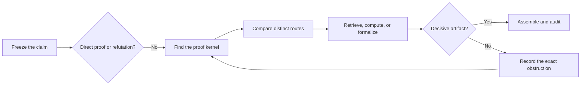
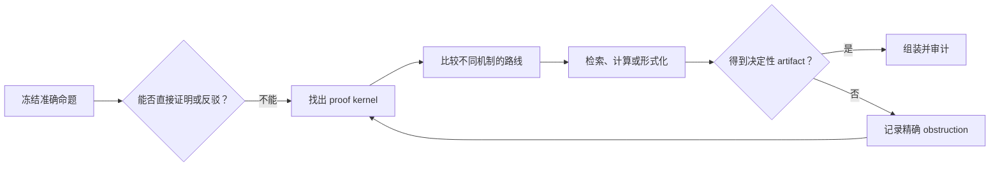

# Codex Theory Proof Workbench

[](SKILL.md)
[](#development)
[](LICENSE)
[](https://github.com/jmf-enigma/codex-theory-proof-workbench/stargazers)

[Quick start](#quick-start) · [Workflow](#workflow) · [Evidence](#evidence) · [Tools](#tool-routing) · [中文](#codex-理论证明工作台)


**A lightweight, auditable proof controller for mathematics that is hard, stuck, or not fully known.**

Theory Proof Workbench is an open Codex skill for proof discovery and recovery. It is aimed at problems where the key lemma, construction, certificate, or even the answer is unclear. It is especially useful in OR/MS, dynamic programming, mechanism design and economics, learning theory, bandits, optimization, games, lower bounds, and probabilistic methods.

It does five things well:

- freezes the exact theorem before proof search drifts;
- tries small cases and counterexamples before writing a long proof;
- compares genuinely different routes and remembers failed ones;
- proactively identifies missing literature, computation, or formal-verification capabilities;
- reports only the proof status supported by replayable evidence.

It does not promise that every true theorem will be solved. When the mathematics is complete and only exposition remains, use `math-proof-writing`.

## Quick Start

### Install With Codex

```text
Use $skill-installer to install the repository-root skill from
https://github.com/jmf-enigma/codex-theory-proof-workbench
as theory-proof-workbench.
```

### Install Manually

```bash
mkdir -p "${CODEX_HOME:-$HOME/.codex}/skills"
git clone https://github.com/jmf-enigma/codex-theory-proof-workbench.git \
  "${CODEX_HOME:-$HOME/.codex}/skills/theory-proof-workbench"
```

Restart Codex or refresh skill discovery. The core requires Python 3.10+ and uses only the standard library. Mathematical backends are optional.

### Ask For A Proof

```text
Use $theory-proof-workbench to prove this theorem. Preserve the exact statement,
test the smallest counterexamples, and find the proof kernel before drafting.

Use $theory-proof-workbench in recovery mode. Read the existing proof state and
do not retry an equivalent construction.

Use $theory-proof-workbench in discovery mode. Check the literature frontier,
freeze one supported candidate, and then prove it.
```

Explicit invocation is the most predictable route. The skill also permits implicit invocation for clearly hard or previously failed proof requests. It starts no resident agent or Wolfram process.

## Workflow



Routine proofs stay small. A hard proof receives a persistent project, an AND/OR lemma graph, compact active state, failed-attempt fingerprints, and one primary next action. Expensive or disclosure-bearing actions expose their expected artifact, budget, and privacy boundary before execution.

The default is a simple prove-check-repair loop. Decomposition, multiple agents, literature scans, CAS, solvers, or Lean are added only when they produce a new artifact or shrink the proof state.

## Evidence

| Status | What it supports |
| --- | --- |
| `conjecture` | A pattern or plausible route, not a proof |
| `counterexample-tested` | Bounded tests found no witness |
| `lemma-conditional` | Named unresolved lemmas still control the theorem |
| `human-proof` | Every nontrivial step has a mathematical justification |
| `tool-checked` | Fragile local claims have replayable computational evidence |
| `formalized-complete` | The exact theorem and final assembly are machine-checked |

Experiments may refute a claim or suggest a formula, but they do not prove a universal statement. A checked local lemma does not prove its parent until the dependency path is assembled. New assumptions and definitions must be sourced or marked as theorem repair.

Search scores, similarity, rankings, default labels, and failed bounded searches only schedule work. They never change proof status without a replayable derivation, counterexample, certificate, source-checked theorem application, or formal check.

## Tool Routing

| Backend | Expected artifact |
| --- | --- |
| Wolfram or SymPy | Exact identity, sign region, quantified condition, symbolic witness |
| Python, Z3, CVXPy, Sage, NetworkX | Finite witness, unsat core, optimization certificate, discrete structure |
| Lean | Stable local lemma or complete formal assembly |
| Peppy and PEPFlow | Exact PEP certificate or verified Lyapunov structure |
| Matlas and TheoremSearch | Statement-level candidate requiring source verification |
| Scholar, arXiv, OpenAlex, DOI and publisher records | Literature coverage, identity, assumptions, and proof anchors |

Remote statement search requires `--remote-ok` and accepts only an abstracted, non-sensitive query. Results remain `retrieved-unverified` until the source, definitions, assumptions, and cited proof are checked. Wolfram, Lean, Peppy, and other optional systems are not installed by this repository.

For research-specific Lean vocabulary, definitions must pass a small semantic gate with a positive witness, an exclusion or characterization lemma, and the downstream properties used by the theorem.

## Durable Projects

Codex normally runs these helpers automatically:

```bash
# Create a persistent project
python3 scripts/start_proof.py --title "short-name" --claim "EXACT CLAIM"

# Select one primary move after a failure
python3 scripts/proof_doctor.py path/to/proof_project

# Read compact active state instead of the full history
python3 scripts/proof_runtime.py brief path/to/proof_project --markdown

# Freeze and verify a stable Lean node
python3 scripts/lean_bridge.py prepare path/to/proof_project \
  --node-id L3 --statement "LEMMA" --target-name Project.L3 \
  --downstream-use "closes node T1"
python3 scripts/lean_bridge.py verify path/to/proof_project \
  path/to/REQUEST.request.json
```

Detailed state transitions and evidence rules live in [SKILL.md](SKILL.md). The [Proof State Machine](references/proof-state-machine.md), [Research-Backed Proof Loop](references/research-backed-proof-loop.md), and [Verification Gate](references/verification-gate.md) are loaded only when needed.

## Design Lineage

The workbench recombines ideas from [Draft, Sketch, and Prove](https://arxiv.org/abs/2210.12283), [Rethlas](https://github.com/frenzymath/Rethlas), [OpenProver](https://arxiv.org/abs/2607.09217), [LeanProgress](https://arxiv.org/abs/2502.17925), [Learning to Disprove](https://arxiv.org/abs/2603.19514), [Beyond the Library](https://arxiv.org/abs/2606.31134), and [AXLE](https://arxiv.org/abs/2606.26442). [Mechanic/MechMath](https://arxiv.org/abs/2603.24465) and [MechMath Agent Team](https://arxiv.org/abs/2607.04394) inform first-error proof surgery, semantic checks on extracted subgoals, typed scratch artifacts, and single-integrator assembly. Public methods from the [SAIR Stage 1 challenge](https://competition.sair.foundation/competitions/mathematics-distillation-challenge-equational-theories-stage1/leaderboard) and [official Stage 2 solvers](https://github.com/SAIRcompetition/equational-theories-lean-stage2) inform deterministic-first search, executable falsification, structured repair, and verified retrieval memory. [Less Is More](https://arxiv.org/abs/2604.18897) informs compact dynamic context. These sources guide workflow design. They do not prove a user's theorem or establish a benchmark result for this repository.

## Development

```bash
python3 -m pip install pyyaml
python3 ~/.codex/skills/.system/skill-creator/scripts/quick_validate.py .
PYTHONPYCACHEPREFIX=/tmp/codex-pycache python3 -m py_compile scripts/*.py
python3 scripts/smoke_workbench.py
```

Contributions should address a named proof bottleneck and include a reproducible check. Use anonymized examples and never upload confidential mathematics. Released under the [MIT License](LICENSE).

---

# Codex 理论证明工作台

[安装](#快速安装) · [工作流](#核心工作流) · [证据](#证据等级) · [工具](#工具调度) · [English](#codex-theory-proof-workbench)

**一个面向困难、卡住或答案尚不明确问题的轻量、可审计证明控制器。**

Theory Proof Workbench 是一个开源 Codex skill，负责发现证明思路、恢复失败证明，并约束工具使用。它适合关键 lemma、构造、certificate 或答案尚不清楚的问题，重点覆盖 OR/MS、动态规划、机制设计与经济理论、learning theory、bandits、优化、博弈、lower bounds 和概率方法。

它主要解决五件事：

- 在证明漂移前冻结准确 theorem；
- 在扩写长证明前检查小规模情形和反例；
- 比较数学机制真正不同的路线并记住失败路线；
- 主动判断是否缺少文献、计算或形式验证能力；
- 只报告可重放证据支持的 proof status。

它不保证每个真命题都能解决。数学已经完整、只需要表达和 LaTeX 时，应改用 `math-proof-writing`。

## 快速安装

### 让 Codex 安装

```text
使用 $skill-installer 安装这个仓库根目录中的 skill：
https://github.com/jmf-enigma/codex-theory-proof-workbench
安装名称使用 theory-proof-workbench。
```

### 手动安装

```bash
mkdir -p "${CODEX_HOME:-$HOME/.codex}/skills"
git clone https://github.com/jmf-enigma/codex-theory-proof-workbench.git \
  "${CODEX_HOME:-$HOME/.codex}/skills/theory-proof-workbench"
```

重启 Codex 或刷新 skill discovery。核心需要 Python 3.10+，只使用标准库。数学后端都是可选项。

### 开始证明

```text
使用 $theory-proof-workbench 证明这个 theorem。保持原命题不变，
先检查最小反例，并在写长证明前找出 proof kernel。

使用 $theory-proof-workbench 的 recovery mode。先读取已有 proof state，
不要再次尝试等价构造。

使用 $theory-proof-workbench 的 discovery mode。先核查文献 frontier，
固定一个有证据支持的 candidate，然后证明它。
```

显式调用最稳定。明显困难或已经失败过的证明请求也允许自动触发。skill 不会启动常驻 Agent 或 Wolfram 进程。

## 核心工作流



常规证明保持轻量。困难证明才建立持久项目、AND/OR lemma graph、紧凑活动状态和失败指纹，并且每轮只选一个首要动作。高成本或会外传内容的动作会先说明预期 artifact、预算和隐私边界。

默认先运行简单的 prove-check-repair 循环。只有 decomposition、多 Agent、文献、CAS、solver 或 Lean 能产生新证据或缩小 proof state 时才升级。

## 证据等级

| 状态 | 能够支持什么 |
| --- | --- |
| `conjecture` | 规律或候选路线，不是证明 |
| `counterexample-tested` | 有界检查没有发现 witness |
| `lemma-conditional` | theorem 仍由明确列出的缺失 lemma 控制 |
| `human-proof` | 每个非平凡步骤都有数学理由 |
| `tool-checked` | 脆弱局部 claim 有可重放计算证据 |
| `formalized-complete` | 准确 theorem 和最终 assembly 均通过机器检查 |

实验可以反驳命题或提示公式，但不能证明 universal statement。局部 lemma 通过检查，也要沿 dependency path 组装后才能升级 parent theorem。新增假设和定义必须有来源，否则只能标记为 theorem repair。

搜索分数、相似度、排名、默认标签和失败的有界搜索只用于调度。除非得到可重放推导、反例、certificate、经来源核对的定理应用或形式检查，否则它们不能改变 proof status。

## 工具调度

| 后端 | 应返回的 artifact |
| --- | --- |
| Wolfram 或 SymPy | 精确恒等式、符号区域、量化条件、symbolic witness |
| Python、Z3、CVXPy、Sage、NetworkX | finite witness、unsat core、optimization certificate、离散结构 |
| Lean | 稳定 local lemma 或完整 formal assembly |
| Peppy 与 PEPFlow | 精确 PEP certificate 或经过核验的 Lyapunov 结构 |
| Matlas 与 TheoremSearch | 仍需核查原文的命题级 candidate |
| Scholar、arXiv、OpenAlex、DOI 与出版社记录 | 文献覆盖、身份、假设和 proof anchor |

远程命题检索必须显式传入 `--remote-ok`，并且只能发送抽象化后的非敏感 query。结果始终是 `retrieved-unverified`，必须继续核对来源、定义、假设和原文证明。本仓库不会安装 Wolfram、Lean、Peppy 或其他可选系统。

如果 Lean 需要论文中特有的新类型或定义，先用正例、排除例或刻画 lemma，以及主 theorem 真正使用的性质检查其语义，再开始主证明。

## 持久证明项目

多数情况下由 Codex 自动调用：

```bash
python3 scripts/start_proof.py --title "short-name" --claim "EXACT CLAIM"
python3 scripts/proof_doctor.py path/to/proof_project
python3 scripts/proof_runtime.py brief path/to/proof_project --markdown
```

完整状态转换与证据规则见 [SKILL.md](SKILL.md)。[Proof State Machine](references/proof-state-machine.md)、[Research-Backed Proof Loop](references/research-backed-proof-loop.md) 和 [Verification Gate](references/verification-gate.md) 只在相关阶段按需读取。

## 设计来源

Workbench 吸收了 [Draft, Sketch, and Prove](https://arxiv.org/abs/2210.12283)、[Rethlas](https://github.com/frenzymath/Rethlas)、[OpenProver](https://arxiv.org/abs/2607.09217)、[LeanProgress](https://arxiv.org/abs/2502.17925)、[Learning to Disprove](https://arxiv.org/abs/2603.19514)、[Beyond the Library](https://arxiv.org/abs/2606.31134) 与 [AXLE](https://arxiv.org/abs/2606.26442) 的部分控制机制。[Mechanic/MechMath](https://arxiv.org/abs/2603.24465) 和 [MechMath Agent Team](https://arxiv.org/abs/2607.04394) 启发了首错局部手术、提取子目标的语义检查、分类型草稿 artifact 与单一 integrator 组装。[SAIR Stage 1](https://competition.sair.foundation/competitions/mathematics-distillation-challenge-equational-theories-stage1/leaderboard) 的公开方法和 [官方 Stage 2 求解器](https://github.com/SAIRcompetition/equational-theories-lean-stage2) 启发了确定性优先搜索、可执行反驳、结构化修复和经过验证的检索记忆。[Less Is More](https://arxiv.org/abs/2604.18897) 启发了精简的动态上下文。这些来源只支持 workflow 设计，不会自动证明用户 theorem，也不代表本仓库已经取得相同 benchmark 结果。

## 开发与许可

运行 `python3 scripts/smoke_workbench.py` 可以执行完整回归检查。贡献应解决明确的证明瓶颈，并提供可复现检查。请使用匿名化例子，不要上传保密数学内容。本仓库使用 [MIT License](LICENSE)。
