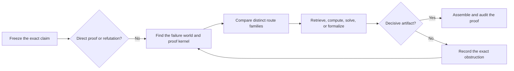
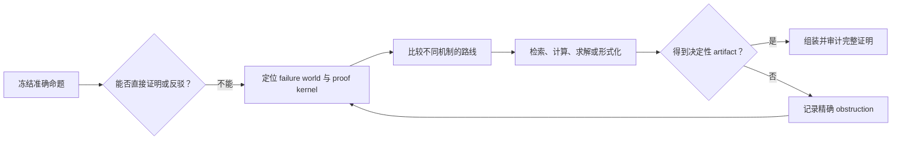

# Codex Theory Proof Workbench

[](SKILL.md)
[](#development)
[](LICENSE)
[](https://github.com/jmf-enigma/codex-theory-proof-workbench/stargazers)

[Install](#quick-start) · [Workflow](#from-a-stuck-proof-to-a-decisive-artifact) · [Evidence](#evidence-and-proof-status) · [Research basis](#research-basis) · [中文说明](#codex-理论证明工作台)


**Auditable proof discovery and recovery for hard mathematical problems.**

Theory Proof Workbench is an open Codex skill for proofs whose core construction, lemma, or even answer is still unknown. It turns repeated drafting into a controlled search for one decisive artifact: a construction, counterexample, lemma, certificate, retrieved theorem pattern, or exact obstruction.

It is built for AI-assisted proof search and proof debugging in OR/MS, dynamic programming, mechanism design and economics, learning theory, bandits, optimization, games, and probabilistic methods. It can coordinate literature retrieval, small-case discovery, Wolfram or SymPy, Z3, CVXPy, Sage, Peppy/PEPFlow, and Lean while keeping evidence levels explicit.

| Discover | Recover | Verify | Report |
| --- | --- | --- | --- |
| Infer candidates from small or tight cases | Detect equivalent retries and salvage valid lemmas | Replay CAS, solver, certificate, and Lean artifacts | Separate proofs, counterexamples, conditional results, and open gaps |

A run may end with a complete proof, a counterexample, a repaired theorem, a conditional result, or the smallest remaining obstruction. Each outcome carries an explicit proof status. The workbench does not guarantee that every true theorem will be proved. For mathematics that is already complete and only needs exposition or LaTeX, use `math-proof-writing` instead.

## Quick Start

### Install With Codex

Paste this into Codex:

```text
Use $skill-installer to install the repository-root skill from
https://github.com/jmf-enigma/codex-theory-proof-workbench
as theory-proof-workbench.
```

### Install Manually

Clone the repository into the Codex skills directory:

```bash
mkdir -p "${CODEX_HOME:-$HOME/.codex}/skills"
git clone https://github.com/jmf-enigma/codex-theory-proof-workbench.git \
  "${CODEX_HOME:-$HOME/.codex}/skills/theory-proof-workbench"
```

Restart Codex or refresh skill discovery. Update the installation later with:

```bash
git -C "${CODEX_HOME:-$HOME/.codex}/skills/theory-proof-workbench" pull --ff-only
```

The skill itself has no third-party Python dependencies. Its helper scripts support Python 3.10 or newer. Wolfram, Lean, Sage, Z3, CVXPy, Peppy/PEPFlow, and other mathematical backends are optional and are not bundled here.

### Run A Proof

For a hard proof:

```text
Use $theory-proof-workbench to prove this theorem. Preserve the exact statement,
test small counterexamples, and identify the proof kernel before writing a long proof.
```

For a proof that has already failed:

```text
Use $theory-proof-workbench in recovery mode. Read the existing ledger, identify
what is genuinely new, and do not retry an equivalent construction.
```

For a problem whose answer or extremal object is not yet known:

```text
Use $theory-proof-workbench in discovery mode. Treat model memory as unverified.
Check the literature frontier, freeze one supported candidate, and then prove it.
```

For strategy without a full proof project:

```text
Use $theory-proof-workbench for a light idea pass. Give me the failure world,
central object, proof kernel, and one checkable next move.
```

Codex can invoke the skill implicitly, but an explicit skill name is the most reliable way to request its full workflow. The workbench runs only while Codex handles a proof task and has no resident background process.

## From A Stuck Proof To A Decisive Artifact



The loop is deliberately selective. It uses literature, computation, multiple agents, or formalization only when one of them can produce a named artifact that changes the proof state.

## Scope

The skill is intended for theoretical work in:

- operations research, management science, optimization, queueing, inventory, scheduling, and control.
- dynamic programming, MDPs, Bellman certificates, threshold policies, and indexability.
- mechanism design, economic theory, IC/IR, envelope arguments, and cyclic monotonicity.
- learning theory, bandits, online learning, regret bounds, and information-theoretic lower bounds.
- games, matching, probabilistic constructions, and the Lovasz Local Lemma.

It is most useful when a central lemma, construction, certificate, or even the answer remains uncertain. Routine algebra and standard theorem applications should stay lightweight.

## What The Workbench Changes

| Common failure | Workbench response |
| --- | --- |
| The argument silently changes the claim | Freeze variables, assumptions, domains, quantifiers, and conclusion in a theorem fence |
| A nearby special case is mistaken for completion | Record an acceptance contract with required edge cases and near-misses that do not count |
| The same route returns under different notation | Compare attempt fingerprints and merge equivalent proof states |
| The central construction is missing | Search small and tight cases, mine exact patterns, and reserve holdout checks |
| The answer may be new or open | Separate candidate discovery from proof and require verified frontier evidence |
| A tool returns numbers but no mathematics | Request a named artifact and translate it into a lemma, certificate, or counterexample |
| One bad step invalidates a long attempt | Locate the first error, retain the verified prefix, and repair affected dependents only |
| Repeated work does not shrink the problem | Change the route or artifact type, repair the theorem, or report an honest stop status |

The unit of progress is evidence. A new paragraph is not progress unless it proves or refutes a kernel, exposes an assumption, supplies a checked certificate, retrieves a usable theorem pattern, or strictly reduces the remaining subgoal.

## Modes

The workbench selects the lightest mode that can produce the next decisive artifact.

| Mode | Use when | Typical result |
| --- | --- | --- |
| Direct | A named theorem, certificate, contradiction, or short decomposition is visible | A checked proof |
| Micro check | A small proof lacks one nearby theorem pattern or standard trick | A precise match or mismatch |
| Light idea | The central object or construction is unclear | A proof kernel and verification hook |
| Discovery | The answer, extremal object, formula, or concept is unknown | A checked candidate and fixed theorem handoff |
| Project | The proof is hard, multi-lemma, tool-assisted, or literature-dependent | Persistent proof state and a lemma graph |
| Recovery | The theorem has failed before | A no-repeat diagnosis and a genuinely new move |

Advanced machinery is conditional. A routine proof does not create a project, run a literature scan, start several agents, or invoke every mathematical backend.

## Proof Loop

1. Freeze the exact statement and write its acceptance contract, including required edge cases and nearby outcomes that do not count.
2. Check direct theorems and certificates, then write the negation and test small, symmetric, boundary, or relaxed-assumption cases.
3. Identify the failure world, central object, and smallest proof kernel that decides the current route.
4. If the answer may be unknown, verify the nearest literature frontier before candidate search. Define a representation, evaluator, holdout set, and promotion rule, then freeze one supported candidate.
5. Seed a small number of routes independently, then group them by mathematical approach family before choosing a favorite. Keep one incompatible shadow family until the leading kernel is decided. Build an AND/OR lemma graph and work on the least-certain required child along the current assembly path.
6. Give every fragile tool or proof move an expected artifact. After failure, preserve valid nodes and repair the first broken dependency. Two unchanged attempts trigger a route change, retrieval, theorem repair, or stop decision.
7. Reassemble the original theorem, map every acceptance item and edge case to a checked proof node, run an adversarial review, and assign the strongest proof status supported by the evidence.

This loop does not guarantee that every true theorem will be proved. It prevents unresolved mathematics from being hidden behind fluent prose and makes the remaining gap reusable in the next attempt.

## What A Run Returns

For a hard problem, the visible result should state:

- the exact claim and essential assumptions.
- the current proof status.
- the decisive proof pattern, proof, counterexample, or exact obstruction.
- the proof-critical artifacts that were checked and how they enter the argument.
- what changed since any previous failure.
- one bounded next move when the theorem remains open.

Internal boards and ledgers stay out of the answer unless they help the reader judge correctness.

## Evidence And Proof Status

Mathematical tools contribute evidence only after their output is translated into a checkable object. Examples include an exact identity, a quantified condition, a KKT or dual certificate, a Bellman inequality, an SMT witness or unsat core, an exact PEP certificate, or a Lean theorem with no admitted gap.

Numerical experiments can falsify a claim or suggest a formula. They do not prove a universal statement. A formal helper lemma also does not close the main theorem when the final assembly still contains `sorry`, an admitted axiom, or an unencoded obligation.

| Status | Meaning |
| --- | --- |
| `conjecture` | The claim currently rests on intuition or a pattern guess |
| `counterexample-tested` | Bounded tests found no counterexample |
| `lemma-conditional` | The theorem follows only if named missing lemmas hold |
| `human-proof` | Every nontrivial step has a stated mathematical justification |
| `tool-checked` | Fragile local steps have replayed or independently checkable computational artifacts |
| `formalized-local` | Important local lemmas are machine-checked |
| `formalized-complete` | The full theorem and its assembly are machine-checked |

`tool-checked` and `formalized-local` can strengthen a human proof, but neither repairs a missing global assembly step. A result is not called proved while its decisive lemma remains conjectural or conditional.

## Persistent Proof Projects

`start_proof.py` creates a durable project for hard or repeated work. The files are loaded as needed rather than injected into every proof attempt.

| Files | Purpose |
| --- | --- |
| `claim.md`, `TRIAGE.md`, `routing.json` | Exact claim, initial mode, and domain routing |
| `ATTACK_MATRIX.md`, `IDEA_MAP.md` | Competing routes, failure worlds, central objects, and kernels |
| `LEMMA_QUEUE.md`, `WORKSTREAMS.md` | AND/OR dependencies, attempt fingerprints, failure localization, and route decisions |
| `PATTERN_SCAN.md`, `TOOL_PLAN.md` | Bounded theorem/trick retrieval and expected computational artifacts |
| `LEDGER.md`, `ESCALATION.md` | Persistent evidence, failed states, proof status, and legal next moves |
| `literature/frontier-evidence.json` | Hashed discovery evidence, exact source anchors, solution cards, and frontier status |
| `.proof_runtime/` | Compact active state, append-only typed events, referee packets, and computation replays |

`proof_doctor.py` recommends one primary next action. `proof_runtime.py brief` exposes only the active status and recent decision-relevant records; it also initializes runtime state for older proof projects. A legacy status such as `complete` is displayed only as an unverified project hint and never silently upgrades runtime evidence. If the theorem in `routing.json` or `claim.md` changes, the runtime refuses stale evidence until `revise-claim --reason ...` records the revision and resets active proof status. After referee review, missing packet evidence is treated as uncertainty, and the doctor targets the first missing dependency while preserving only computation claims whose project-local artifacts still pass the integrity audit. The full history remains in the ledger.

## Command-Line Helpers

Most users can let Codex run these scripts. They are also available directly:

```bash
cd "${CODEX_HOME:-$HOME/.codex}/skills/theory-proof-workbench"

# Compact idea map
python3 scripts/plan_idea.py "CLAIM"

# Durable project, with --mode recovery or --mode discovery when appropriate
python3 scripts/start_proof.py --title "short-name" --claim "EXACT CLAIM"

# One primary next move
python3 scripts/proof_doctor.py path/to/proof_project

# Compact resume context
python3 scripts/proof_runtime.py brief path/to/proof_project --markdown

# Inspect a fresh-context referee packet before spending another model pass
python3 scripts/run_referee.py path/to/proof_project --proof writeup/candidate.md --prepare-only

# Audit a proof-critical computation after recording and replaying it
python3 scripts/computation_artifact.py audit path/to/proof_project ARTIFACT_ID

# Final ledger audit
python3 scripts/audit_ledger.py path/to/proof_project/LEDGER.md
```

Add `--full` to `plan_idea.py` only when the compact pass does not reveal a useful kernel. Add `--json` to `proof_doctor.py` for machine-readable output. Preparing a referee packet is local. Running it through another model requires host permission and user approval to share the selected packet; when unavailable, the workbench records that limit and falls back to local adversarial review plus exact replay without claiming independent review.

| Script | Purpose |
| --- | --- |
| `select_playbook.py` | Route a claim to the relevant domain playbook |
| `check_attempt.py` | Detect an equivalent route or construction before retrying |
| `pattern_miner.py` | Guess exact formulas from small-case sequences and test holdouts |
| `new_lemma_card.py` | Save a lemma that has proved useful in a real route |
| `new_trick_card.py` | Save a validated paper or proof trick |
| `frontier_evidence.py` | Fetch, hash, anchor, and validate frontier literature evidence |
| `proof_runtime.py` | Maintain compact active state and append-only decision records |
| `run_referee.py` | Prepare or run a fresh-context, read-only referee pass on a complete candidate |
| `computation_artifact.py` | Record, replay, audit, and explicitly supersede proof-critical artifacts |

Discovery projects use `frontier_evidence.py` to record executed Scholar evidence, retrieve lawful open full text, hash local copies, and preserve exact theorem or proof anchors. Its SSRN route resolves stable identities and verified open mirrors instead of manufacturing temporary signed URLs. Its DOI route supports INFORMS records and compares working-paper versions with the published record. See [Full-Text Frontier Evidence](references/full-text-frontier-evidence.md).

If the mathematical environment provides `codex-math-python`, it can replace `python3`. This repository does not require that wrapper.

## Mathematical Backends

Before a tool call, the workbench names the local claim, domains, negation to test, backend, expected artifact, and how the result would change the proof state. A route stops after repeated timeouts or outputs that do not decide or shrink the subgoal.

Direct one-line calls remain available for cheap exploration and falsification. A proof-critical result is promoted only after its project-local script, assumptions, backend version, expected check, and executable fingerprint are recorded, replayed, and audited in the current project. Exact counterexamples, symbolic identities, condition sets, and solver certificates must match canonical expected output; process exit alone is not mathematical agreement. Aggregate drivers must reject child timeouts, nonzero exits, output mismatches, and unexpected child stderr rather than trust a final summary token. This layer audits trusted mathematical scripts; it is not a sandbox for hostile code.

Typical roles include:

- Wolfram or SymPy for exact algebra, sign conditions, quantifier elimination, and small symbolic counterexamples.
- Python, Z3, CVXPy, OR-Tools, Sage, and NetworkX for finite witnesses, optimization certificates, and discrete structures.
- Lean for stable local lemmas after the informal statement is precise.
- simulation for falsification and sensitivity checks, never as a universal proof.

### Wolfram

Install [Wolfram Engine](https://www.wolfram.com/engine/) and [WolframScript](https://reference.wolfram.com/language/workflow/InstallWolframScript.html.en) separately. A minimal check is:

```bash
wolframscript -code '2+2'
```

If `math-tools` provides `wmath` or `codex-wmath`, the workbench can use those wrappers for bounded symbolic calls. They are not installed by this repository.

### Peppy And PEPFlow

When the companion `peppy` skill and a [PEPFlow](https://github.com/pepflow-lib/PEPFlow) checkout are available, fixed-algorithm performance problems can move through rate discovery, dual-certificate extraction, Lyapunov structure, and closed-form verification. The route starts only when the algorithm, function or operator class, normalization, performance metric, and horizon pass the [Peppy proof bridge](references/peppy-proof-bridge.md). Numerical sweeps remain conjecture evidence, and the workflow stops when another block would not improve the proof status.

The mathematical basis is credited to the original sources:

- [Drori and Teboulle (2014)](https://doi.org/10.1007/s10107-013-0653-0) introduced performance estimation for first-order methods.
- [Taylor, Hendrickx, and Glineur (2017)](https://doi.org/10.1007/s10107-016-1009-3) developed exact smooth strongly convex interpolation and finite-dimensional SDP representations. Their [composite convex extension](https://doi.org/10.1137/16M108104X) covers a broader oracle model.
- [Taylor, Van Scoy, and Lessard (2018)](https://proceedings.mlr.press/v80/taylor18a.html) developed automated tight quadratic Lyapunov analyses.
- [Suh, Ying, Jiang, and Nguyen (2025)](https://openreview.net/forum?id=tJqsZZBmmB) describe PEPFlow's numerical-to-symbolic proof workflow.
- [Suh, Yoon, Nguyen, Ying, and Ma (2026)](https://openreview.net/forum?id=q7TfzOgGnb) introduce Peppy and its five-stage AI-assisted workflow. The corresponding command files and examples are in the official PEPFlow [`peppy-workshop-v1` release](https://github.com/pepflow-lib/PEPFlow/tree/peppy-workshop-v1/examples_peppy).

The five block skills `pep-implement`, `pep-full-proof`, `lyap-define`, `lyap-vectors`, and `lyap-closed-form` originate from that official Peppy release. The local `peppy` shortcut selects and resumes those blocks. It is a convenience layer, not an independent implementation or a rebranding of PEP, interpolation theory, Peppy, or PEPFlow.

PEPFlow remains a separate [Apache-2.0 project](https://github.com/pepflow-lib/PEPFlow/blob/main/LICENSE). Research that materially uses this route should cite both Peppy and PEPFlow, together with the methodology source matching the encoded class. Cite PEPit or another implementation only when it was actually used.

## Multi-Agent Work

Parallel agents are opt-in. When requested, split them by artifact: planner, falsifier, retriever, local tool-checker or formalizer, and reviewer. One integrator remains responsible for statement fidelity, route choice, and final proof status. Several agents should not produce competing prose versions of the same route.

The runtime layer is also opt-in and one-shot. It starts no daemon, resident agent pool, or Wolfram kernel; a referee or computation process exists only for its bounded invocation.

For open-ended strategy search, independent scouts may instead return one compact route card each. They receive the same theorem fence but not the current favorite or one another's narratives. The integrator groups cards by mathematical mechanism, redirects saturated families, and shares ideas only after each live family has exposed a concrete artifact or exact gap.

## Repository Layout

```text
.
├── SKILL.md
├── agents/openai.yaml
├── references/
│   ├── proof-router.md
│   ├── research-backed-proof-loop.md
│   ├── novel-problem-discovery.md
│   ├── peppy-proof-bridge.md
│   ├── domain playbooks
│   └── verification and escalation rules
└── scripts/
    ├── start_proof.py
    ├── proof_doctor.py
    ├── proof_runtime.py
    ├── run_referee.py
    ├── computation_artifact.py
    ├── frontier_evidence.py
    ├── smoke_workbench.py
    └── focused state and pattern helpers
```

`SKILL.md` contains the compact controller. Detailed procedures live in references and are read only when the current decision requires them. Scripts handle deterministic project state, routing, retrieval evidence, and audits.

## Research Basis

The workbench converts ideas from proof search, formalization, and mathematical discovery into lightweight control rules. The main design threads are:

- Proof decomposition and graph repair draw on [Draft, Sketch, and Prove](https://arxiv.org/abs/2210.12283), [Goedel-Architect](https://arxiv.org/abs/2606.06468), and [LEAP](https://arxiv.org/abs/2606.03303).
- Formal feedback, premise retrieval, and source fidelity draw on [Aristotle](https://arxiv.org/abs/2510.01346), [Goedel-Prover-V2](https://arxiv.org/abs/2508.03613), [process-verified theorem proving](https://arxiv.org/abs/2606.20068), [LeanSearch v2](https://arxiv.org/abs/2605.13137), [LeanMarathon](https://arxiv.org/abs/2606.05400), and [MerLean-Prover](https://arxiv.org/abs/2605.26959).
- Independent checking and honest failure outcomes draw on [Prover-Verifier Games](https://arxiv.org/abs/2407.13692), [Aletheia](https://arxiv.org/abs/2602.10177), [Scaling Generative Verifiers](https://arxiv.org/abs/2511.13027), [Formal Conjectures](https://arxiv.org/abs/2605.13171), and the verifier-replay separation in [Rethlas](https://github.com/frenzymath/Rethlas).
- Persistent research state and stage-aware repair draw on [STAR-PolyaMath](https://arxiv.org/abs/2605.19338), the [AI co-mathematician](https://arxiv.org/abs/2605.06651), [Prover Agent](https://arxiv.org/abs/2506.19923), [Delta Prover](https://arxiv.org/abs/2507.15225), and [Hilbert](https://arxiv.org/abs/2509.22819).
- Evaluator-driven discovery draws on [AlphaEvolve](https://arxiv.org/abs/2506.13131), [Discover and Prove](https://arxiv.org/abs/2604.15839), [PatternBoost](https://arxiv.org/abs/2411.00566), [Generative Modelling for Mathematical Discovery](https://arxiv.org/abs/2503.11061), [AI-assisted open-problem discovery](https://arxiv.org/abs/2603.04735), [self-supervised theorem discovery](https://arxiv.org/abs/2606.28747), [MLEvolve](https://arxiv.org/abs/2606.06473), [QED](https://arxiv.org/abs/2604.24021), and [From Solvers to Research](https://arxiv.org/abs/2607.07779).

The operational mapping appears in [Research-Backed Proof Loop](references/research-backed-proof-loop.md) and [Novel Problem Discovery](references/novel-problem-discovery.md). These papers motivate workflow decisions. They do not serve as proof authority for a user's theorem.

## Try It On A Real Proof

- [Star the repository](https://github.com/jmf-enigma/codex-theory-proof-workbench) if it is useful and you want it in your starred list. Use `Watch > Custom > Releases` for release notifications.
- [Open an issue](https://github.com/jmf-enigma/codex-theory-proof-workbench/issues/new) with an anonymized failed-proof case. Include the exact claim, what was tried, the first known obstruction, and the evidence available. Do not upload confidential manuscripts or private research data.
- Contribute a reproducible proof pattern, verifier, backend adapter, or failure case. New machinery should solve a named proof bottleneck and include a deterministic check or test.

The most useful feedback is not “the answer was bad.” It is a small, inspectable case showing where routing, discovery, verification, or proof-state recovery failed.

## Development

The helper scripts use the Python standard library. The Codex skill validator additionally needs PyYAML.

```bash
python3 -m pip install pyyaml
python3 ~/.codex/skills/.system/skill-creator/scripts/quick_validate.py .
PYTHONPYCACHEPREFIX=/tmp/codex-pycache python3 -m py_compile scripts/*.py
python3 scripts/smoke_workbench.py
python3 scripts/pattern_miner.py --seq "1,4,9,16,25" --start 1
```

The smoke test checks routing, recovery activation, first-error salvage, discovery evidence gates, Peppy attribution, compact runtime state, fresh-context referee controls, replayed computation artifacts, portable paths, and proof handoff. Referee and Wolfram paths use mock executables, so the test consumes no model call and launches no Wolfram kernel. It does not claim a measured theorem-solving benchmark gain.

## License

This repository is released under the MIT License. See [LICENSE](LICENSE). Optional third-party backends retain their own licenses.

---

# Codex 理论证明工作台

[English](#codex-theory-proof-workbench) · [安装](#快速开始) · [工作流](#从卡住的证明到决定性-artifact) · [证据标准](#证据与证明状态)

**面向 Codex 的可审计证明发现与失败恢复。**

Theory Proof Workbench 是一个开源 Codex skill，面向核心构造、关键 lemma，甚至答案本身仍未知的困难证明。它不靠反复扩写证明，而是把任务变成对一个决定性 artifact 的受控搜索。这个 artifact 可以是构造、反例、lemma、certificate、从论文中核实的 theorem pattern，或者精确的 obstruction。

它主要服务于 OR/MS、动态规划、机制设计与经济理论、learning theory、bandits、优化、博弈和概率方法中的 AI 辅助证明搜索与 proof debugging。它可以按需协调文献检索、小规模规律发现、Wolfram 或 SymPy、Z3、CVXPy、Sage、Peppy/PEPFlow 和 Lean，同时明确区分不同证据等级。

| 发现 | 恢复 | 核验 | 报告 |
| --- | --- | --- | --- |
| 从小规模或紧例中猜出候选结构 | 识别等价重试并保留有效 lemma | 重放 CAS、solver、certificate 和 Lean artifact | 区分完整证明、反例、条件结论与未闭合缺口 |

一次运行可能得到完整证明、反例、修正后的 theorem、条件性结论，或者当前最小的未解决 obstruction。每种结果都会带有明确的 proof status。Workbench 不保证每个真命题都能被证明。数学内容已经完成，只需要改善表述或 LaTeX 时，应使用 `math-proof-writing`。

## 快速开始

### 让 Codex 安装

把下面这段直接发给 Codex：

```text
使用 $skill-installer 安装这个仓库根目录中的 skill：
https://github.com/jmf-enigma/codex-theory-proof-workbench
安装名称使用 theory-proof-workbench。
```

### 手动安装

把仓库克隆到 Codex 的 skills 目录：

```bash
mkdir -p "${CODEX_HOME:-$HOME/.codex}/skills"
git clone https://github.com/jmf-enigma/codex-theory-proof-workbench.git \
  "${CODEX_HOME:-$HOME/.codex}/skills/theory-proof-workbench"
```

重启 Codex 或刷新 skill discovery。以后更新可以运行：

```bash
git -C "${CODEX_HOME:-$HOME/.codex}/skills/theory-proof-workbench" pull --ff-only
```

Skill 本身不依赖第三方 Python package，辅助脚本支持 Python 3.10 及以上版本。Wolfram、Lean、Sage、Z3、CVXPy、Peppy/PEPFlow 等数学后端都是可选项，本仓库不会自动安装。

### 开始证明

证明一个困难 theorem：

```text
使用 $theory-proof-workbench 证明这个 theorem。保持原命题不变，先检查小型反例，
在写长证明之前找出 proof kernel。
```

继续一个已经失败过的证明：

```text
使用 $theory-proof-workbench 的 recovery mode。先读取已有 ledger，说明这次真正
新增了什么，不要再次尝试等价构造。
```

答案或 extremal object 仍未知：

```text
使用 $theory-proof-workbench 的 discovery mode。把模型记忆视为 unverified，
先核查文献 frontier，固定一个有证据支持的 candidate，然后再证明它。
```

只需要一次思路分析：

```text
使用 $theory-proof-workbench 做 light idea pass。给出 failure world、central object、
proof kernel 和一个可以检查的 next move。
```

Codex 可以隐式触发这个 skill，但显式写出 skill 名称最稳定。Workbench 只在 Codex 处理当前证明任务时运行，不是常驻后台服务。

## 从卡住的证明到决定性 Artifact



这个循环会有选择地升级。只有当文献、计算、多 Agent 或形式化工具能够产生一个会改变 proof state 的明确 artifact 时，才调用相应能力。

## 适用范围

这个 skill 主要用于以下理论问题：

- 运筹、管理科学、优化、排队、库存、调度和控制。
- 动态规划、MDP、Bellman certificate、threshold policy 和 indexability。
- 机制设计、经济理论、IC/IR、envelope argument 和 cyclic monotonicity。
- learning theory、bandits、online learning、regret bound 和信息论 lower bound。
- 博弈、匹配、概率构造和 Lovasz Local Lemma。

当 central lemma、构造、certificate，甚至答案本身仍不确定时，它最有价值。常规代数和标准定理应用应保持轻量。

## 它具体改变什么

| 常见失败 | Workbench 的处理方式 |
| --- | --- |
| 推导过程中悄悄改变了命题 | 用 theorem fence 固定变量、假设、domain、quantifier 和结论 |
| 把相近 special case 当成完整结论 | 写出 acceptance contract，列明必须覆盖的边界情形以及哪些近似结果不算完成 |
| 同一路线换符号后再次出现 | 比较 attempt fingerprint，合并等价 proof state |
| 缺少核心构造 | 检查小例子和 tight case，寻找精确规律，并保留 holdout 验证 |
| 答案可能是新的或仍然 open | 把 candidate discovery 与 proof 分开，并要求可核验的 frontier evidence |
| 工具只返回数字 | 事先指定 artifact，再把输出转化成 lemma、certificate 或反例 |
| 一个坏步骤拖垮整条路线 | 找到第一处错误，回收 verified prefix，只修复受影响的 dependent |
| 多次尝试都没有缩小问题 | 更换路线或 artifact，修正 theorem，或者诚实停止 |

这里把证据视为进展。只有当一次尝试证明或反驳了 kernel、暴露了缺失假设、产生了经过检查的 certificate、找到了能进入组装的 theorem pattern，或者严格缩小了剩余 subgoal，它才算真正推进。

## 模式选择

Workbench 会选择足以产生下一个决定性 artifact 的最轻模式。

| Mode | 适用情况 | 典型结果 |
| --- | --- | --- |
| Direct | 已经看到标准 theorem、certificate、contradiction 或短分解 | 经过检查的证明 |
| Micro check | 小证明只缺一个相近 theorem pattern 或标准 trick | 精确匹配或明确不匹配 |
| Light idea | Central object 或构造仍不清楚 | Proof kernel 和 verification hook |
| Discovery | 答案、extremal object、公式或概念仍未知 | 经过检查的 candidate 和固定 theorem handoff |
| Project | 证明困难、多 lemma、需要工具或文献 | 持久化 proof state 和 lemma graph |
| Recovery | 同一 theorem 以前已经失败 | No-repeat 诊断和真正的新路线 |

高级流程都是条件触发。普通证明不会自动创建项目、扫描文献、启动多个 Agent，或者遍历所有数学后端。

## 证明循环

1. 固定精确命题并写出 acceptance contract，包括必须覆盖的边界情形，以及哪些相近结论不算完成。
2. 检查直接 theorem 与 certificate，再写出命题的否定，并测试小规模、对称、边界和放松假设的情形。
3. 找出 failure world、central object，以及能够决定当前路线的最小 proof kernel。
4. 如果答案可能未知，先核查最近的文献 frontier。随后定义 candidate representation、evaluator、holdout 和 promotion rule，再固定一个有证据支持的 candidate。
5. 先独立生成少量路线，再按数学机制归入 approach family，之后才选择当前主路线。在 leading kernel 得到判定前保留一个不兼容的 shadow family。建立 AND/OR lemma graph，优先处理当前 assembly path 上最不确定的 required child。
6. 每个脆弱的工具调用或证明动作都必须声明 expected artifact。失败后保留有效节点，只修复第一处损坏的 dependency。两次尝试都没有改变 proof state 时，必须更换路线、检索、修正命题或停止。
7. 最后重新组装原 theorem，把每个 acceptance item 和边界情形映射到经过检查的 proof node，再进行 adversarial review，并给出证据能够支持的最强 proof status。

这个流程不能保证每个真 theorem 都会被证明。它能防止尚未解决的数学问题被流畅文字掩盖，也能让当前 gap 在下一次尝试中继续使用。

## 一次运行会返回什么

对于困难问题，最终可见结果应包含：

- 精确 claim 和必要假设。
- 当前 proof status。
- 决定性的 proof pattern、证明、反例或精确 obstruction。
- 已检查的 proof-critical artifact，以及它们如何进入论证。
- 相比之前失败真正新增的内容。
- theorem 仍未闭合时，一个有边界的 next move。

内部 board 和 ledger 默认不会出现在最终回答中，除非它们能帮助读者判断正确性。

## 证据与证明状态

数学工具的输出只有转化成可检查对象后才能进入证明。例如 exact identity、quantified condition、KKT 或 dual certificate、Bellman inequality、SMT witness 或 unsat core、exact PEP certificate，以及没有 admitted gap 的 Lean theorem。

数值实验可以反驳 claim 或帮助猜公式，但不能证明 universal statement。如果最终 assembly 仍含 `sorry`、admitted axiom 或未编码 obligation，那么局部 formal lemma 也没有闭合主 theorem。

| Status | 含义 |
| --- | --- |
| `conjecture` | 当前只有直觉或 pattern guess |
| `counterexample-tested` | 有限测试中没有发现反例 |
| `lemma-conditional` | Theorem 只有在明确列出的 missing lemma 成立时才成立 |
| `human-proof` | 每个非平凡步骤都有明确的数学依据 |
| `tool-checked` | 脆弱局部步骤有可重放或可独立检查的计算 artifact |
| `formalized-local` | 重要 local lemma 已经 machine-checked |
| `formalized-complete` | 完整 theorem 及其 assembly 已经 machine-checked |

`tool-checked` 和 `formalized-local` 可以增强 human proof，但不能替代缺失的全局 assembly。决定性 lemma 仍是 conjectural 或 conditional 时，结果不能称为 proved。

## 持久化证明项目

`start_proof.py` 会为困难或重复失败的任务创建持久化项目。这些文件按需加载，不会在每次证明时全部进入上下文。

| 文件 | 作用 |
| --- | --- |
| `claim.md`、`TRIAGE.md`、`routing.json` | 精确 claim、初始 mode 和领域路由 |
| `ATTACK_MATRIX.md`、`IDEA_MAP.md` | 备选路线、failure world、central object 和 kernel |
| `LEMMA_QUEUE.md`、`WORKSTREAMS.md` | AND/OR dependency、attempt fingerprint、failure localization 和 route decision |
| `PATTERN_SCAN.md`、`TOOL_PLAN.md` | 有边界的 theorem/trick 检索和 expected computational artifact |
| `LEDGER.md`、`ESCALATION.md` | 持久证据、失败状态、proof status 和合法 next move |
| `literature/frontier-evidence.json` | 带哈希的 discovery evidence、精确 source anchor、solution card 和 frontier status |
| `.proof_runtime/` | 精简 active state、append-only typed event、referee packet 和 computation replay |

`proof_doctor.py` 会推荐一个首要 next action。`proof_runtime.py brief` 只暴露 active status 和最近的 decision-relevant record，同时会为旧 proof project 自动建立 runtime。旧项目的 `complete` 等状态只显示为未验证提示，不会静默升级 runtime 证据。如果 `routing.json` 或 `claim.md` 中的 theorem 改变，runtime 会拒绝沿用旧证据，直到 `revise-claim --reason ...` 记录这次修改并重置 active proof status。referee 发现 packet 缺材料时会判为 `uncertain`，doctor 随后只补首个缺失依赖，并且只保留当前项目中仍通过完整性审计的 computation claim。完整历史仍保留在 ledger 中。

## 命令行辅助工具

多数情况下可以让 Codex 自动运行这些脚本，也可以直接调用：

```bash
cd "${CODEX_HOME:-$HOME/.codex}/skills/theory-proof-workbench"

# 精简 idea map
python3 scripts/plan_idea.py "CLAIM"

# 持久化项目，需要时加入 --mode recovery 或 --mode discovery
python3 scripts/start_proof.py --title "short-name" --claim "EXACT CLAIM"

# 一个首要 next move
python3 scripts/proof_doctor.py path/to/proof_project

# 精简的续跑上下文
python3 scripts/proof_runtime.py brief path/to/proof_project --markdown

# 再花一次模型调用前，先检查 fresh-context referee packet
python3 scripts/run_referee.py path/to/proof_project --proof writeup/candidate.md --prepare-only

# 记录并重放 proof-critical computation 后，再审计其当前完整性
python3 scripts/computation_artifact.py audit path/to/proof_project ARTIFACT_ID

# 最终 ledger audit
python3 scripts/audit_ledger.py path/to/proof_project/LEDGER.md
```

只有精简的 `plan_idea.py` 找不到 useful kernel 时才加入 `--full`。`proof_doctor.py` 可以使用 `--json` 输出机器可读结果。准备 referee packet 是本地操作；把 packet 交给另一个模型需要运行环境许可和用户同意共享所选内容。该步骤不可用时，workbench 会记录限制，改做本地 adversarial review 和精确 replay，并且不会冒充 independent review。

| Script | 用途 |
| --- | --- |
| `select_playbook.py` | 根据 claim 选择领域 playbook |
| `check_attempt.py` | 重试前识别等价路线或构造 |
| `pattern_miner.py` | 从小规模序列猜测精确公式并检查 holdout |
| `new_lemma_card.py` | 保存已经在真实路线中发挥作用的 lemma |
| `new_trick_card.py` | 保存经过验证的论文或证明 trick |
| `frontier_evidence.py` | 获取、哈希、定位并验证 frontier 文献证据 |
| `proof_runtime.py` | 保存精简 active state 和 append-only decision record |
| `run_referee.py` | 为完整候选证明准备或运行 fresh-context、read-only referee |
| `computation_artifact.py` | 记录、重放、审计并显式替换 proof-critical artifact |

Discovery project 使用 `frontier_evidence.py` 保存真实执行过的 Scholar 证据，获取合法公开全文，对本地文件计算哈希，并记录精确 theorem 或 proof anchor。SSRN 路由会解析稳定 identity 和经过核验的公开镜像，不会制造临时 signed URL。DOI 路由支持 INFORMS 记录，并比较 working paper 与正式发表版本。细节见 [全文 Frontier 证据](references/full-text-frontier-evidence.md)。

如果数学环境提供 `codex-math-python`，可以用它替换 `python3`。本仓库不依赖这个 wrapper。

## 数学后端

每次工具调用之前，workbench 都会声明 local claim、domain、准备测试的 negation、backend、expected artifact，以及结果将如何改变 proof state。如果连续 timeout 或输出不能决定或缩小 subgoal，这条工具路线就会停止。

便宜的探索和反驳仍可直接使用一行命令。只有把 project-local script、assumption、backend version、expected check 和 executable fingerprint 记录，在当前项目中成功 replay 并通过 audit 后，proof-critical result 才能升级状态。精确反例、symbolic identity、condition set 和 solver certificate 必须匹配 canonical expected output；程序正常退出本身不代表数学结果一致。批量 driver 还必须拒绝任何 child timeout、nonzero exit、output mismatch 和意外 child stderr，不能只相信最后一个 summary token。这一层审计的是可信数学脚本，并不是运行恶意代码的 sandbox。

常见分工包括：

- Wolfram 或 SymPy 用于 exact algebra、sign condition、quantifier elimination 和小型 symbolic counterexample。
- Python、Z3、CVXPy、OR-Tools、Sage 和 NetworkX 用于 finite witness、optimization certificate 和 discrete structure。
- Lean 用于 informal statement 已经稳定的 local lemma。
- simulation 只用于反驳和 sensitivity check，不作为 universal proof。

### Wolfram

[Wolfram Engine](https://www.wolfram.com/engine/) 和 [WolframScript](https://reference.wolfram.com/language/workflow/InstallWolframScript.html.en) 需要单独安装。最小检查命令是：

```bash
wolframscript -code '2+2'
```

如果 `math-tools` 提供 `wmath` 或 `codex-wmath`，workbench 可以通过这些 wrapper 运行有边界的 symbolic call。本仓库不会安装它们。

### Peppy 与 PEPFlow

当本机已经安装配套的 `peppy` skill 和 [PEPFlow](https://github.com/pepflow-lib/PEPFlow) checkout 时，固定算法的性能问题可以依次进行 rate discovery、dual certificate 提取、Lyapunov 结构识别和 closed-form verification。只有算法、函数或算子类、normalization、performance metric 与 horizon 通过 [Peppy 证明桥接规则](references/peppy-proof-bridge.md) 后，这个分支才会启动。数值 sweep 仍只算 conjecture evidence。下一 block 不再提升 proof status 时，流程就会停止。

相关数学来源如下：

- [Drori 和 Teboulle（2014）](https://doi.org/10.1007/s10107-013-0653-0)提出了用于一阶方法的 performance estimation。
- [Taylor、Hendrickx 和 Glineur（2017）](https://doi.org/10.1007/s10107-016-1009-3)给出了精确的 smooth strongly convex interpolation 与有限维 SDP 表示，三位作者的 [composite convex 扩展](https://doi.org/10.1137/16M108104X)覆盖了更广的 oracle model。
- [Taylor、Van Scoy 和 Lessard（2018）](https://proceedings.mlr.press/v80/taylor18a.html)研究了自动化的 tight quadratic Lyapunov analysis。
- [Suh、Ying、Jiang 和 Nguyen（2025）](https://openreview.net/forum?id=tJqsZZBmmB)说明了 PEPFlow 从数值分析走向符号证明的流程。
- [Suh、Yoon、Nguyen、Ying 和 Ma（2026）](https://openreview.net/forum?id=q7TfzOgGnb)提出了 Peppy 及其五阶段 AI-assisted workflow。对应的命令文件与示例收录在 PEPFlow 官方的 [`peppy-workshop-v1` release](https://github.com/pepflow-lib/PEPFlow/tree/peppy-workshop-v1/examples_peppy) 中。

五个 block skill `pep-implement`、`pep-full-proof`、`lyap-define`、`lyap-vectors` 和 `lyap-closed-form` 都直接来自这次官方 Peppy release。本地 `peppy` shortcut 负责选择和续跑这些 block。它只是便利的调度层，不是独立实现，也不会重新主张 PEP、interpolation theory、Peppy 或 PEPFlow 的原创归属。

PEPFlow 是独立的 [Apache-2.0 项目](https://github.com/pepflow-lib/PEPFlow/blob/main/LICENSE)。论文中的结果如果实质使用了这条路线，应同时引用 Peppy 与 PEPFlow，并根据所编码的问题类引用对应的方法论文。只有实际使用 PEPit 或其他实现时才应引用它们。

## 多 Agent 工作

并行 Agent 只在用户要求时启用。合理分工按照 artifact 划分，包括 planner、falsifier、retriever、local tool-checker 或 formalizer、reviewer。始终由一个 integrator 负责 statement fidelity、route choice 和最终 proof status。多个 Agent 不应同时为同一路线撰写互相竞争的 prose 版本。

Runtime layer 同样按需、一次性启动。它不会常驻 daemon、agent pool 或 Wolfram kernel。Referee 与 computation process 只在有 timeout 的单次调用中存在。

开放式策略搜索可以改用 independent scout。每个 scout 只返回一张紧凑的 route card，拿到相同 theorem fence，但不会看到当前 favorite 或其他 scout 的叙述。Integrator 先按数学机制合并同 family 路线，把新增搜索转向尚未充分探索的 family，等每条 live family 都给出具体 artifact 或精确 gap 后再交流思路。

## 仓库结构

```text
.
├── SKILL.md
├── agents/openai.yaml
├── references/
│   ├── proof-router.md
│   ├── research-backed-proof-loop.md
│   ├── novel-problem-discovery.md
│   ├── peppy-proof-bridge.md
│   ├── domain playbooks
│   └── verification and escalation rules
└── scripts/
    ├── start_proof.py
    ├── proof_doctor.py
    ├── proof_runtime.py
    ├── run_referee.py
    ├── computation_artifact.py
    ├── frontier_evidence.py
    ├── smoke_workbench.py
    └── focused state and pattern helpers
```

`SKILL.md` 只保留精简 controller。详细流程放在 references 中，并且只在当前 decision 需要时读取。Scripts 负责确定性的 project state、routing、retrieval evidence 和 audit。

## 研究来源

Workbench 把 proof search、formalization 和 mathematical discovery 中的研究方法转化成轻量控制规则。主要来源可以分成几条线：

- Proof decomposition 与 graph repair 参考 [Draft, Sketch, and Prove](https://arxiv.org/abs/2210.12283)、[Goedel-Architect](https://arxiv.org/abs/2606.06468) 和 [LEAP](https://arxiv.org/abs/2606.03303)。
- Formal feedback、premise retrieval 和 source fidelity 参考 [Aristotle](https://arxiv.org/abs/2510.01346)、[Goedel-Prover-V2](https://arxiv.org/abs/2508.03613)、[process-verified theorem proving](https://arxiv.org/abs/2606.20068)、[LeanSearch v2](https://arxiv.org/abs/2605.13137)、[LeanMarathon](https://arxiv.org/abs/2606.05400) 和 [MerLean-Prover](https://arxiv.org/abs/2605.26959)。
- Independent checking 与诚实 failure outcome 参考 [Prover-Verifier Games](https://arxiv.org/abs/2407.13692)、[Aletheia](https://arxiv.org/abs/2602.10177)、[Scaling Generative Verifiers](https://arxiv.org/abs/2511.13027)、[Formal Conjectures](https://arxiv.org/abs/2605.13171)，以及 [Rethlas](https://github.com/frenzymath/Rethlas) 的 verifier-replay 分离设计。
- 持久化 research state 与 stage-aware repair 参考 [STAR-PolyaMath](https://arxiv.org/abs/2605.19338)、[AI co-mathematician](https://arxiv.org/abs/2605.06651)、[Prover Agent](https://arxiv.org/abs/2506.19923)、[Delta Prover](https://arxiv.org/abs/2507.15225) 和 [Hilbert](https://arxiv.org/abs/2509.22819)。
- Evaluator-driven discovery 参考 [AlphaEvolve](https://arxiv.org/abs/2506.13131)、[Discover and Prove](https://arxiv.org/abs/2604.15839)、[PatternBoost](https://arxiv.org/abs/2411.00566)、[Generative Modelling for Mathematical Discovery](https://arxiv.org/abs/2503.11061)、[AI-assisted open-problem discovery](https://arxiv.org/abs/2603.04735)、[self-supervised theorem discovery](https://arxiv.org/abs/2606.28747)、[MLEvolve](https://arxiv.org/abs/2606.06473)、[QED](https://arxiv.org/abs/2604.24021) 和 [From Solvers to Research](https://arxiv.org/abs/2607.07779)。

具体的流程映射见 [Research-Backed Proof Loop](references/research-backed-proof-loop.md) 和 [Novel Problem Discovery](references/novel-problem-discovery.md)。这些论文用于支持 workflow decision，不会被当成用户 theorem 的证明依据。

## 用真实证明来测试它

- 如果这个项目有用，可以先 [Star 这个仓库](https://github.com/jmf-enigma/codex-theory-proof-workbench)，把它留在 starred list 中。需要接收版本通知时，使用 `Watch > Custom > Releases`。
- 可以提交一个经过匿名化的 [failed-proof issue](https://github.com/jmf-enigma/codex-theory-proof-workbench/issues/new)。请写清准确命题、已经尝试的路线、目前最早的 obstruction 和已有证据。不要上传保密论文或私人研究数据。
- 欢迎贡献可复现的证明套路、verifier、数学后端适配或失败案例。新增机制应针对一个明确的证明瓶颈，并带有确定性检查或测试。

最有价值的反馈不是简单说“答案不好”，而是给出一个可检查的小案例，说明 routing、discovery、verification 或 proof-state recovery 在哪里失效。

## 开发检查

辅助脚本只使用 Python 标准库。Codex 的 skill validator 还需要 PyYAML。

```bash
python3 -m pip install pyyaml
python3 ~/.codex/skills/.system/skill-creator/scripts/quick_validate.py .
PYTHONPYCACHEPREFIX=/tmp/codex-pycache python3 -m py_compile scripts/*.py
python3 scripts/smoke_workbench.py
python3 scripts/pattern_miner.py --seq "1,4,9,16,25" --start 1
```

Smoke test 检查 routing、recovery activation、first-error salvage、discovery evidence gate、Peppy 归属、精简 runtime state、fresh-context referee control、可重放 computation artifact、portable path 和 proof handoff。Referee 与 Wolfram 路线使用 mock executable，因此测试不会消耗模型调用，也不会启动 Wolfram kernel。它不声称已经测得 theorem-solving benchmark 的提升。

## 许可证

本仓库使用 MIT License，详见 [LICENSE](LICENSE)。可选第三方后端保留各自的许可证。
