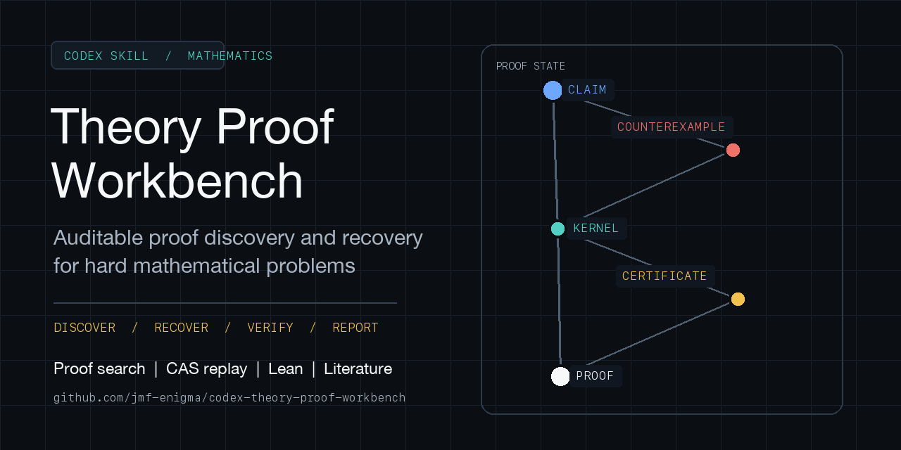
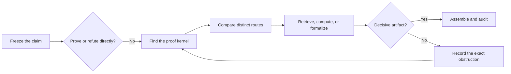
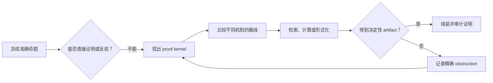

# Codex Theory Proof Workbench

[](SKILL.md)
[](#development)
[](LICENSE)
[](https://github.com/jmf-enigma/codex-theory-proof-workbench/stargazers)

[Quick start](#quick-start) · [Workflow](#workflow) · [Evidence](#evidence-and-proof-status) · [Backends](#mathematical-backends) · [中文说明](#codex-理论证明工作台)



**Auditable proof discovery and recovery for hard mathematical problems.**

Theory Proof Workbench is an open Codex skill for unresolved mathematics, especially when the construction, key lemma, or even the answer is unknown. It controls proof search, remembers failed routes, and asks every tool or strategy to produce a checkable artifact.

It is designed for OR/MS, dynamic programming, mechanism design and economics, learning theory, bandits, optimization, games, and probabilistic methods.

| Discover | Recover | Verify | Report |
| --- | --- | --- | --- |
| Infer candidates from small or tight cases | Avoid equivalent retries and salvage valid lemmas | Replay CAS, solver, certificate, and Lean artifacts | Distinguish proofs, counterexamples, conditional results, and open gaps |

The workbench does not guarantee every true theorem. Use `math-proof-writing` when only exposition or LaTeX remains.

## Quick Start

### Install With Codex

Paste this into Codex:

```text
Use $skill-installer to install the repository-root skill from
https://github.com/jmf-enigma/codex-theory-proof-workbench
as theory-proof-workbench.
```

### Install Manually

```bash
mkdir -p "${CODEX_HOME:-$HOME/.codex}/skills"
git clone https://github.com/jmf-enigma/codex-theory-proof-workbench.git \
  "${CODEX_HOME:-$HOME/.codex}/skills/theory-proof-workbench"
```

Restart Codex or refresh skill discovery. The core uses Python 3.10+ and the standard library. Mathematical backends are optional and unbundled.

### Use It

```text
Use $theory-proof-workbench to prove this theorem. Preserve the exact statement,
test small counterexamples, and identify the proof kernel before writing a long proof.

Use $theory-proof-workbench in recovery mode. Read the existing ledger and do not
retry an equivalent construction.

Use $theory-proof-workbench in discovery mode. Verify the literature frontier,
freeze one supported candidate, and then prove it.
```

Invoke the skill explicitly. It runs only for the current task and starts no resident agent or Wolfram process.

## Workflow



1. Freeze variables, domains, assumptions, quantifiers, conclusion, and required edge cases.
2. Try to refute the claim before expanding a long proof.
3. Identify the smallest lemma, construction, certificate, or barrier that decides the route.
4. Compare mathematically distinct routes and give each one an expected artifact and check.
5. Preserve valid partial results, repair the first broken dependency, and stop equivalent retries.
6. Reassemble the original theorem and assign only the proof status supported by the evidence.

Routine proofs stay lightweight. Formal tasks start with the smallest checker-feedback loop. Escalate to decomposition, literature, multiple agents, CAS, solvers, or Lean only when they change the proof state and preserve final assembly. See [SKILL.md](SKILL.md) and the [Research-Backed Proof Loop](references/research-backed-proof-loop.md).

## When To Use It

| Use the workbench | Keep the task lightweight |
| --- | --- |
| A central construction, lemma, certificate, or answer is unclear | Routine algebra or a standard theorem application |
| The proof has failed or repeated before | The proof is complete and only needs writing |
| Literature or mathematical tools are needed to decide a local claim | A numerical sanity check with no universal claim |
| The theorem may need repair or an honest obstruction report | A short derivation with an already visible route |

A run may return a complete proof, counterexample, repaired theorem, conditional result, or the smallest remaining obstruction.

## Evidence And Proof Status

| Status | Meaning |
| --- | --- |
| `conjecture` | The claim still rests on intuition or a pattern guess |
| `counterexample-tested` | Bounded tests found no counterexample |
| `lemma-conditional` | Named missing lemmas still control the theorem |
| `human-proof` | Every nontrivial step has a stated mathematical justification |
| `tool-checked` | Fragile local steps have replayable computational artifacts |
| `formalized-complete` | The full theorem and assembly are machine-checked |

Experiments can falsify a claim or suggest a formula, but they do not prove a universal statement or repair missing assembly. Added assumptions and definitions must be sourced or marked as theorem repair. Kernel acceptance proves the encoded theorem, not the quality of a reusable API. See the [Verification Gate](references/verification-gate.md).

## Mathematical Backends

| Backend | Typical artifact |
| --- | --- |
| Wolfram or SymPy | Exact identity, sign condition, quantified region, symbolic counterexample |
| Python, Z3, CVXPy, Sage, NetworkX | Finite witness, unsat core, optimization certificate, discrete structure |
| Lean | Stable local lemma or complete formal assembly |
| Peppy and PEPFlow | Exact PEP certificate or verified Lyapunov structure |
| Literature tools | Verified theorem pattern, assumptions, proof anchor, and source metadata |

[Wolfram Engine](https://www.wolfram.com/engine/) and [WolframScript](https://reference.wolfram.com/language/workflow/InstallWolframScript.html.en) are separate installations. The workbench can use `wmath` or `codex-wmath` when available, but does not install them.

The Peppy route is conditional on an exactly encoded fixed-algorithm performance problem. Numerical sweeps remain conjecture evidence until an exact certificate passes the [Peppy Proof Bridge](references/peppy-proof-bridge.md). Peppy and its workflow come from the [Peppy paper](https://openreview.net/forum?id=q7TfzOgGnb) and the official [PEPFlow repository](https://github.com/pepflow-lib/PEPFlow); this repository provides orchestration, not a separate implementation.

## Durable Proof Projects

Most users can let Codex run the helpers automatically. The main commands are:

```bash
# Start a persistent proof project
python3 scripts/start_proof.py --title "short-name" --claim "EXACT CLAIM"

# Select one primary next move after a failure
python3 scripts/proof_doctor.py path/to/proof_project

# Run deterministic workflow checks
python3 scripts/smoke_workbench.py
```

Add `--mode recovery` or `--mode discovery` when appropriate. Full commands, state transitions, replay rules, and reference routing live in [SKILL.md](SKILL.md) and the [Proof State Machine](references/proof-state-machine.md).

## Research Foundations And Refinements

**Foundations.** [Draft, Sketch, and Prove](https://arxiv.org/abs/2210.12283), [Goedel-Architect](https://arxiv.org/abs/2606.06468), the [AI co-mathematician](https://arxiv.org/abs/2605.06651), [STAR-PolyaMath](https://arxiv.org/abs/2605.19338), [AlphaEvolve](https://arxiv.org/abs/2506.13131), [Aristotle](https://arxiv.org/abs/2510.01346), and [Rethlas](https://github.com/frenzymath/Rethlas) motivate decomposition, persistent state, coordinated routes, evaluator-driven discovery, AND/OR search, and separation of exploration from verification. The workbench recombines these ideas rather than reimplementing any system.

**Refinements.** [APRIL](https://arxiv.org/abs/2602.02990) and [AlphaProof Nexus](https://arxiv.org/abs/2605.22763) refine checker-grounded repair and the simple-loop default. [$k$-server-bench](https://arxiv.org/abs/2604.07240) and [QEDBench](https://arxiv.org/abs/2602.20629) sharpen evaluator and reviewer limits. [Hypothesis-disciplined formalization](https://arxiv.org/abs/2606.20642), [AI4SLT](https://arxiv.org/abs/2602.02285), and [Sorries Are Not the Hard Part](https://arxiv.org/abs/2606.13925) add source, semantic, trust, and reuse audits. These studies extend rather than replace the foundations. Full mappings are in [Research-Backed Proof Loop](references/research-backed-proof-loop.md) and [Novel Problem Discovery](references/novel-problem-discovery.md). Sources guide control decisions, not theorem proof or a workbench benchmark.

## Contributing

[Star the repository](https://github.com/jmf-enigma/codex-theory-proof-workbench) if useful. [Open an issue](https://github.com/jmf-enigma/codex-theory-proof-workbench/issues/new) with an anonymized claim, route, first obstruction, and evidence. Never upload confidential work.

Contributions should address a named proof bottleneck and include a reproducible check or test.

## Development

```bash
python3 -m pip install pyyaml
python3 ~/.codex/skills/.system/skill-creator/scripts/quick_validate.py .
PYTHONPYCACHEPREFIX=/tmp/codex-pycache python3 -m py_compile scripts/*.py
python3 scripts/smoke_workbench.py
```

## License

Released under the [MIT License](LICENSE). Optional backends retain their own licenses.

---

# Codex 理论证明工作台

[English](#codex-theory-proof-workbench) · [快速开始](#快速开始) · [工作流](#工作流) · [证据标准](#证据与证明状态) · [数学后端](#数学后端)

**面向困难数学问题的可审计证明发现与失败恢复。**

Theory Proof Workbench 是一个开源 Codex skill，适用于核心构造、关键 lemma，甚至答案本身仍未知的数学问题。它负责控制 proof search、保存失败路线，并要求每个工具或策略产生可以检查的 artifact。

主要领域包括 OR/MS、动态规划、机制设计与经济理论、learning theory、bandits、优化、博弈和概率方法。

| 发现 | 恢复 | 核验 | 报告 |
| --- | --- | --- | --- |
| 从小规模或 tight case 中猜测候选结构 | 避免等价重试并保留有效 lemma | 重放 CAS、solver、certificate 和 Lean artifact | 区分完整证明、反例、条件结论和未闭合缺口 |

Workbench 不保证每个真命题都能证明。只剩表达或 LaTeX 时，请使用 `math-proof-writing`。

## 快速开始

### 让 Codex 安装

```text
使用 $skill-installer 安装这个仓库根目录中的 skill：
https://github.com/jmf-enigma/codex-theory-proof-workbench
安装名称使用 theory-proof-workbench。
```

### 手动安装

```bash
mkdir -p "${CODEX_HOME:-$HOME/.codex}/skills"
git clone https://github.com/jmf-enigma/codex-theory-proof-workbench.git \
  "${CODEX_HOME:-$HOME/.codex}/skills/theory-proof-workbench"
```

重启 Codex 或刷新 skill discovery。核心使用 Python 3.10+ 标准库。数学后端均为可选项，不会自动安装。

### 开始使用

```text
使用 $theory-proof-workbench 证明这个 theorem。保持原命题不变，先检查小型反例，
在写长证明之前找出 proof kernel。

使用 $theory-proof-workbench 的 recovery mode。先读取已有 ledger，
不要再次尝试等价构造。

使用 $theory-proof-workbench 的 discovery mode。先核查文献 frontier，
固定一个有证据支持的 candidate，然后再证明它。
```

请显式调用 skill。它只在当前任务中运行，不会启动常驻 Agent 或 Wolfram 进程。

## 工作流



1. 冻结变量、domain、假设、quantifier、结论和必须覆盖的边界情形。
2. 在扩写长证明之前，先尝试反驳命题。
3. 找到能够决定当前路线的最小 lemma、构造、certificate 或 barrier。
4. 比较数学机制不同的路线，并为每条路线指定 expected artifact 和检查方式。
5. 保留有效局部结果，修复第一个失效依赖，并停止等价重试。
6. 重新组装原 theorem，只报告证据真正支持的 proof status。

常规证明保持轻量。形式化任务从最小 checker-feedback loop 开始。只有 decomposition、文献、多 Agent、CAS、solver 或 Lean 能改变 proof state，并保持最终 assembly 时才会升级。详见 [SKILL.md](SKILL.md) 与 [Research-Backed Proof Loop](references/research-backed-proof-loop.md)。

## 什么时候使用

| 适合使用 Workbench | 应保持轻量 |
| --- | --- |
| 核心构造、lemma、certificate 或答案仍不清楚 | 常规代数或标准定理应用 |
| 证明以前失败过或发生重复 | 证明已经完整，只需要写作 |
| 需要文献或数学工具判断局部 claim | 仅做数值 sanity check，且没有 universal claim |
| theorem 可能需要修正或报告精确 obstruction | 路线已经清楚的短推导 |

一次运行可能得到完整证明、反例、修正后的 theorem、条件结论，或者当前最小的未解决 obstruction。

## 证据与证明状态

| 状态 | 含义 |
| --- | --- |
| `conjecture` | 结论仍来自直觉或规律猜测 |
| `counterexample-tested` | 有界测试没有发现反例 |
| `lemma-conditional` | theorem 仍依赖明确列出的缺失 lemma |
| `human-proof` | 每个非平凡步骤都有数学理由 |
| `tool-checked` | 脆弱局部步骤带有可重放计算 artifact |
| `formalized-complete` | 完整 theorem 和 assembly 已通过机器检查 |

实验可以反驳命题或提示公式，但不能证明 universal statement，也不能补上缺失的 assembly。新增假设与定义必须给出来源，否则要标为 theorem repair。Lean kernel 只证明已编码 theorem，不保证 API 可复用。完整标准见 [Verification Gate](references/verification-gate.md)。

## 数学后端

| 后端 | 典型 artifact |
| --- | --- |
| Wolfram 或 SymPy | 精确恒等式、符号条件、量化区域、symbolic counterexample |
| Python、Z3、CVXPy、Sage、NetworkX | finite witness、unsat core、optimization certificate、离散结构 |
| Lean | 稳定的 local lemma 或完整 formal assembly |
| Peppy 与 PEPFlow | 精确 PEP certificate 或经过核验的 Lyapunov 结构 |
| 文献工具 | 经过核验的 theorem pattern、假设、proof anchor 和 source metadata |

[Wolfram Engine](https://www.wolfram.com/engine/) 与 [WolframScript](https://reference.wolfram.com/language/workflow/InstallWolframScript.html.en) 需要单独安装。Workbench 可以使用已有的 `wmath` 或 `codex-wmath`，但不会安装它们。

Peppy 路线只适用于准确编码的固定算法 performance problem。数值 sweep 仍属于 conjecture evidence，必须通过 [Peppy Proof Bridge](references/peppy-proof-bridge.md) 才能升级。Peppy 与其工作流来自 [Peppy 论文](https://openreview.net/forum?id=q7TfzOgGnb)和官方 [PEPFlow 仓库](https://github.com/pepflow-lib/PEPFlow)。本仓库只负责调度，不是独立实现。

## 持久化证明项目

多数情况下可以让 Codex 自动运行辅助脚本。主要命令如下：

```bash
# 建立持久 proof project
python3 scripts/start_proof.py --title "short-name" --claim "EXACT CLAIM"

# 失败后选择一个首要 next move
python3 scripts/proof_doctor.py path/to/proof_project

# 运行确定性 workflow 检查
python3 scripts/smoke_workbench.py
```

需要时加入 `--mode recovery` 或 `--mode discovery`。完整命令、状态转换、replay 规则和 reference routing 见 [SKILL.md](SKILL.md) 与 [Proof State Machine](references/proof-state-machine.md)。

## 研究基础与后续校准

**基础架构。** [Draft, Sketch, and Prove](https://arxiv.org/abs/2210.12283)、[Goedel-Architect](https://arxiv.org/abs/2606.06468)、[AI co-mathematician](https://arxiv.org/abs/2605.06651)、[STAR-PolyaMath](https://arxiv.org/abs/2605.19338)、[AlphaEvolve](https://arxiv.org/abs/2506.13131)、[Aristotle](https://arxiv.org/abs/2510.01346) 与 [Rethlas](https://github.com/frenzymath/Rethlas) 支持 decomposition、持久状态、路线协作、evaluator-driven discovery、AND/OR search，以及探索与验证分离。Workbench 对这些机制进行重新组合，并不复刻任何一个系统。

**后续校准。** [APRIL](https://arxiv.org/abs/2602.02990) 与 [AlphaProof Nexus](https://arxiv.org/abs/2605.22763) 校准 checker-grounded repair 和简单循环优先。[$k$-server-bench](https://arxiv.org/abs/2604.07240) 与 [QEDBench](https://arxiv.org/abs/2602.20629) 补充 evaluator 和 reviewer 的边界。[Hypothesis-disciplined formalization](https://arxiv.org/abs/2606.20642)、[AI4SLT](https://arxiv.org/abs/2602.02285) 与 [Sorries Are Not the Hard Part](https://arxiv.org/abs/2606.13925) 加入来源、语义、trust 与复用审计。这些研究是在扩展基础架构，并非替换它。完整映射见 [Research-Backed Proof Loop](references/research-backed-proof-loop.md) 与 [Novel Problem Discovery](references/novel-problem-discovery.md)。论文只支持 control decision，不证明用户 theorem，也不是 Workbench benchmark。

## 参与贡献

项目有用时可以 [Star 仓库](https://github.com/jmf-enigma/codex-theory-proof-workbench)。反馈请提交匿名化 [issue](https://github.com/jmf-enigma/codex-theory-proof-workbench/issues/new)，写明命题、路线、首个 obstruction 和证据。不要上传保密工作。

新增贡献应针对一个明确的证明瓶颈，并带有可复现的检查或测试。

## 开发检查

```bash
python3 -m pip install pyyaml
python3 ~/.codex/skills/.system/skill-creator/scripts/quick_validate.py .
PYTHONPYCACHEPREFIX=/tmp/codex-pycache python3 -m py_compile scripts/*.py
python3 scripts/smoke_workbench.py
```

## 许可证

本仓库使用 [MIT License](LICENSE)。可选第三方后端保留各自的许可证。
